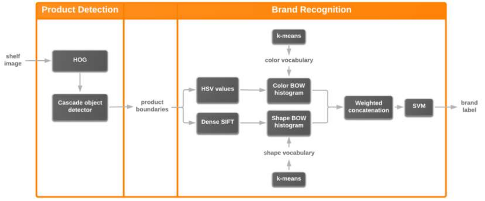

# nn-grocery-shelves
Recognition of product positions on shelf images using neural networks


## Introduction

### What is a planogram?
- Visual description of the retail products' placement on shelves.

The solution is based on [Toward Retail Product Recognition on Grocery Shelves](https://pdfs.semanticscholar.org/280e/57ea3e882f82a60065fedde058ce00769c06.pdf).

Few years ago a planogram reconstruction from shelves photos was not an easy task in both products detection and brands recognition. The work mentioned above
proposes the following combination of algorithms.



Nowdays neural networks change the way of thinking of such tasks. This work shows that all these algorithms could be easily replaced
by only 2 neural networks with increase of recognition quality without losing performance.

## Dependencies

Solution depends on the following main libraries:
*   Tensorlfow
*   Keras
*   Tensorflow Object Detection API
*   OpenCV

Even though Windows and Mac OS are pretty acceptable for Tensorflow I recommend 
Ubuntu 16.04. It will save you a huge amount of time. Tensorflow for CPU installation
is easy, but is not as straightforward for GPU. For detailed steps to install Tensorflow 
on Ubuntu 16.04 with an Nvidia GPU, follow this [paper](https://www.quantstart.com/articles/installing-tensorflow-on-ubuntu-1604-with-an-nvidia-gpu)

Tensorflow Object Detection API installation instructions located [here](https://github.com/tensorflow/models/blob/master/research/object_detection/g3doc/installation.md).

Keras can be installed using pip:
``` bash
pip install keras
```


